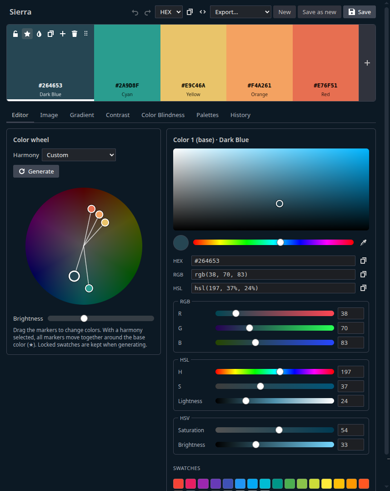
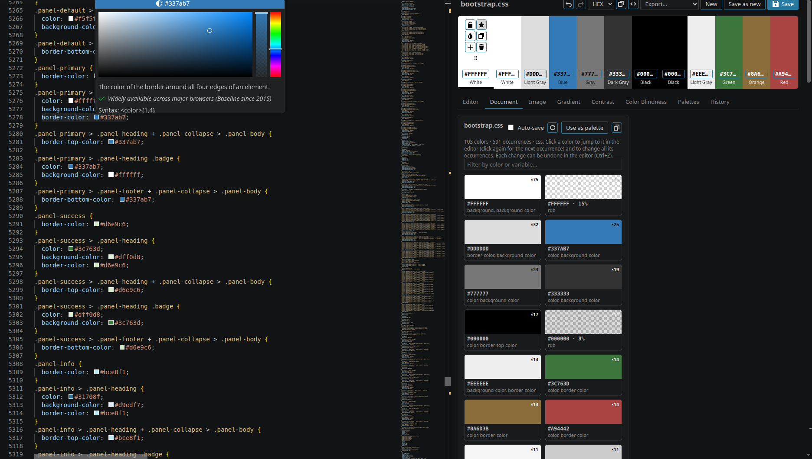
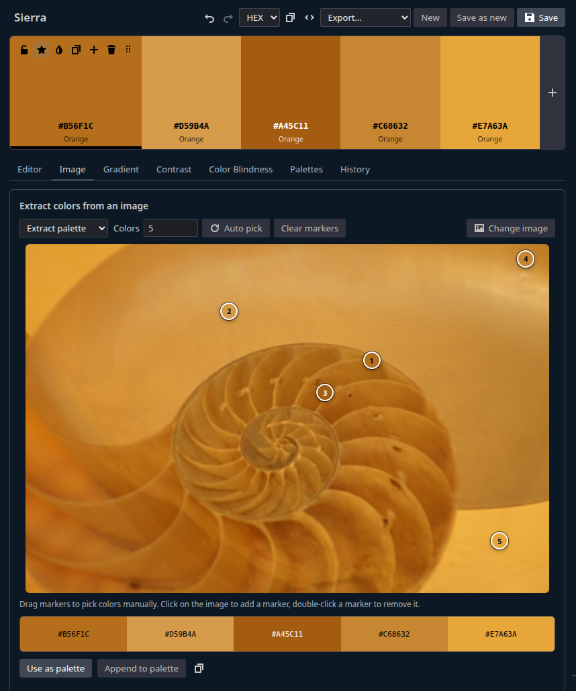
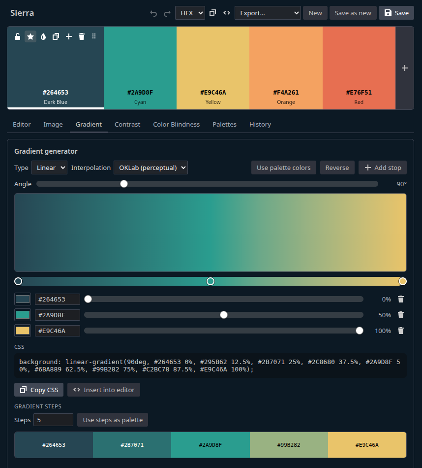
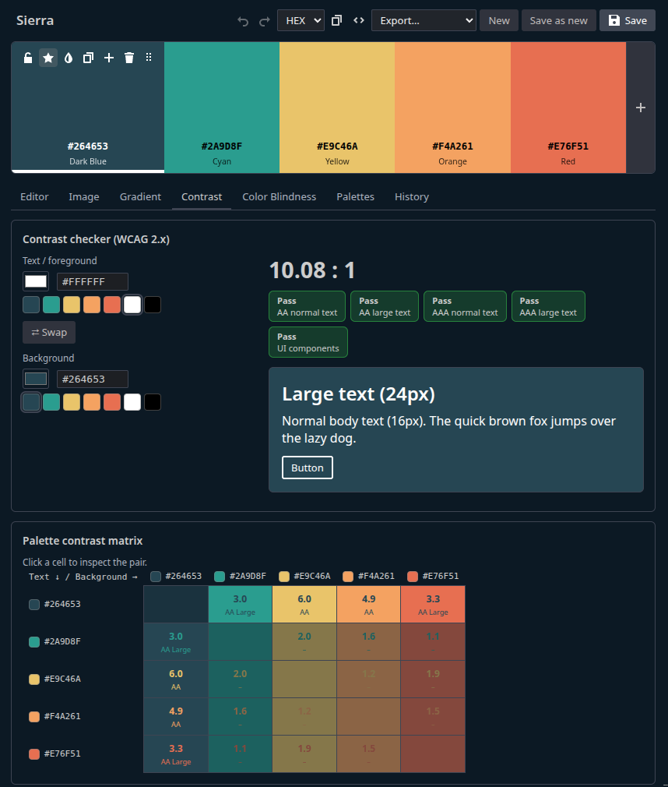
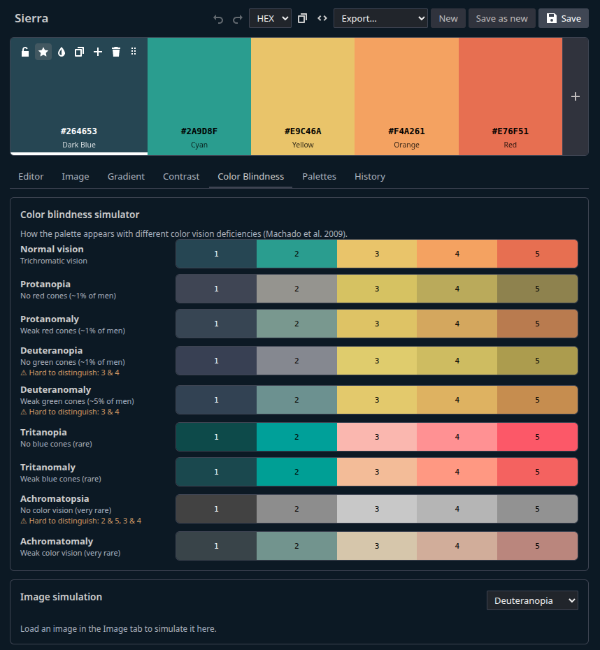
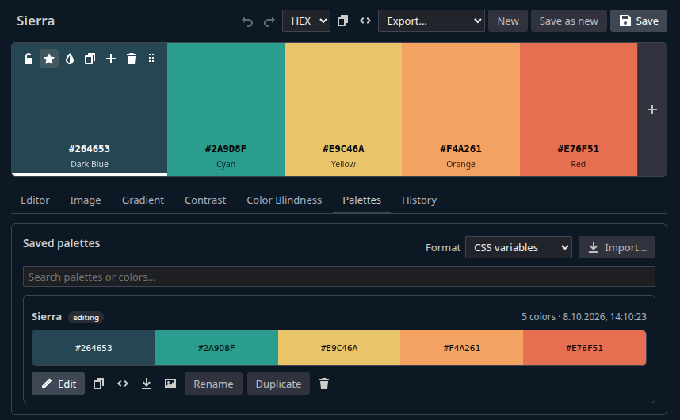
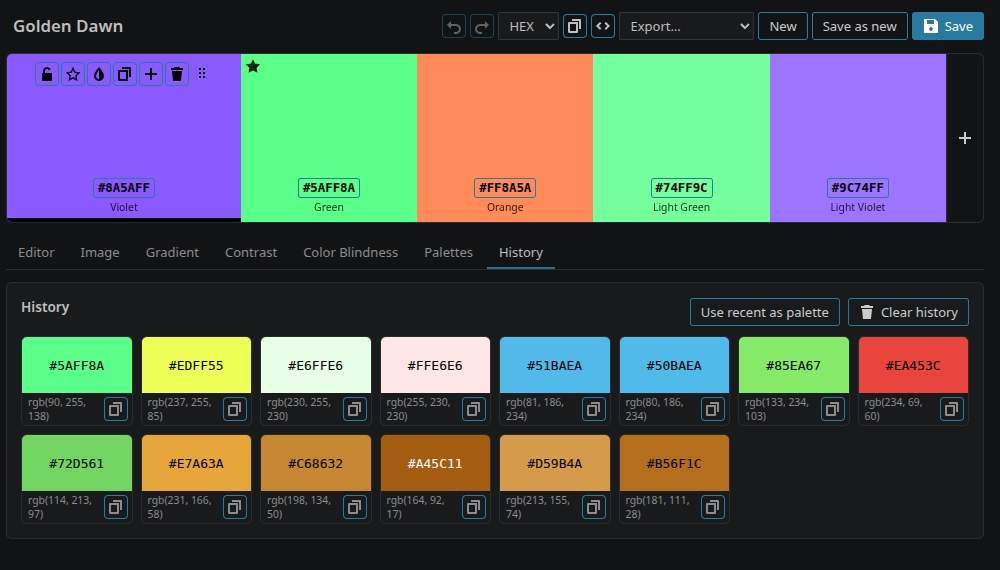

  

<h1 align="center">Color Palette Creator</h1>

  <strong>Pick, generate, extract and check colors without leaving VS Code, and edit the colors of your code live.</strong>

  
  
  
  

  

## ✨ Why Color Palette Creator?

- 🎨 **Everything in one place:** color picker, palette generator, image extraction, gradients, contrast and
  accessibility checks in a single panel next to your code.
- ⚡ **Live in your code:** change a color once and every occurrence in the file is updated instantly, in its
  original notation. Perfect for Bootstrap, Tailwind or any CSS theme.
- 🖌️ **Color boxes everywhere:** a color picker in front of every HEX, RGB, HSL and HSV code in **any**
  language, not just CSS.
- ♿ **Accessible by design:** WCAG contrast ratings and a color blindness simulator help you build palettes
  everybody can see.
- 📦 **Ready for your stack:** export to CSS, SCSS, LESS, JSON, Tailwind, JS/TS, GIMP palettes, plain text or PNG.

## 🚀 Quick start

1. Install **Color Palette Creator** from the Visual Studio Marketplace.
2. Press `Ctrl+Alt+P` (`Cmd+Alt+P` on macOS) or click **Palette** in the status bar.
3. Press `Space` to generate a palette, or open a CSS file and switch to the **Document** tab to edit its colors
   live.

## 🎯 Features

### 🎨 Palette editor and color picker

Build palettes from 2 to 12 swatches and fine-tune every color.

- Add, delete, reorder (drag and drop), lock and copy swatches
- Choose a **base color** and edit **tints and shades** with one click
- Picker with saturation/brightness area, hue slider and **RGB, HSL and HSV sliders**
- HEX, RGB and HSL input fields, preset swatches and an **eyedropper** that picks colors anywhere on the screen
- Undo/redo and automatic saving of your working palette

### 🌈 Color wheel and harmonies

Drag the markers on the interactive color wheel and let harmonies do the work:
**Analogous, Complementary, Split Complementary, Triad, Square, Compound, Shades, Monochromatic, Random**
or fully **Custom**. Locked swatches are kept when generating.

### ⚡ Live document colors

The **Document** tab turns the colors of the open file into swatches, grouped by value, with variable names
such as `--bs-primary` and the number of occurrences.

- Change a swatch and **all occurrences are rewritten instantly**, keeping each notation (HEX case, short HEX,
  `rgb()`, `hsl()`, alpha, and Bootstrap `--*-rgb` triplets)
- Click a swatch to **jump to the code**, click again for the next occurrence
- Optional **auto-save** so live reload servers show the result immediately
- Use the document colors as a palette with one click

### 🖌️ Inline color pickers

A small color box with VS Code's color picker appears in front of color codes in every language:
`#rgb`, `#rrggbbaa`, `rgb()`, `rgba()`, `hsl()`, `hsla()`, `hsv()`, `hsva()` and Bootstrap RGB triplets.
Edits keep the original notation. In CSS, SCSS and LESS only the formats missing in VS Code's built-in picker are
added, so you never get duplicate boxes.

### 🖼️ Extract colors from images

Drop, paste or upload an image and get its dominant colors automatically. Drag the markers to fine-tune, click to
add new ones, or **extract a gradient** along a line.

### 🌅 Gradient generator

Create linear, radial and conic gradients with any number of stops, choose the angle and interpolate in
**OKLab**, RGB or HSL. Copy the CSS, insert it into your code or turn the gradient steps into a palette.

### ♿ Contrast checker

Check text and UI colors against **WCAG 2.x** (AA and AAA, normal and large text, UI components), preview the
result, get suggestions for passing colors and see the contrast of every color pair in your palette.

### 👓 Color blindness simulator

See your palette with protanopia, deuteranopia, tritanopia, their anomalous variants and achromatopsia. Colors
that become hard to tell apart are flagged, and uploaded images can be simulated too.

### 📚 Saved palettes and export

Save, rename, duplicate, search, edit and delete palettes. Export them, save them as PNG images, import palette
files or insert them straight into your code.

| Format | Example |
| --- | --- |
| CSS variables | `--ocean-1: #003049;` |
| SCSS / LESS variables | `$ocean-1: #003049;` / `@ocean-1: #003049;` |
| JSON | `{ "name": "Ocean", "colors": ["#003049"] }` |
| Tailwind config | `colors: { ocean: { 100: '#003049' } }` |
| JavaScript / TypeScript | `export const ocean = { color1: '#003049' } as const;` |
| GIMP palette, plain text, PNG image | for design tools and documentation |

### 🕘 Color history

Every color you copy, pick or edit is remembered. Re-apply it to a swatch, copy it again or turn your recent
colors into a palette.

## ⌨️ Commands and shortcuts

All commands are available in the command palette under **Color Palette**.

| Command | Shortcut |
| --- | --- |
| Open Color Palette Creator | `Ctrl+Alt+P` / `Cmd+Alt+P` |
| Edit Colors of Current File (also in the editor context menu) | `Ctrl+Alt+Shift+P` / `Cmd+Alt+Shift+P` |
| Extract Colors from Image (also in the explorer context menu of images) | |
| Open Gradient Generator, Contrast Checker, Color Blindness Simulator | |
| Manage Saved Palettes, Show Color History | |
| Insert Saved Palette..., Export Saved Palette..., Import Palette from File... | |
| Toggle Inline Color Boxes, Clear Color History | |

Inside the panel: `Space` generates a new palette, `Ctrl+Z` / `Ctrl+Y` undo and redo.

## ⚙️ Settings

| Setting | Default | Description |
| --- | --- | --- |
| `colorPaletteCreator.inlineColors.enabled` | `true` | Show inline color boxes in the editor |
| `colorPaletteCreator.inlineColors.excludedLanguages` | `[]` | Languages without inline color boxes |
| `colorPaletteCreator.inlineColors.builtInLanguages` | `["css", "scss", "less"]` | Languages with a built-in color provider (only missing formats are added) |
| `colorPaletteCreator.documentColors.autoSave` | `false` | Save the file after color changes in the Document tab |
| `colorPaletteCreator.defaultExportFormat` | `css` | Format used when inserting or exporting palettes |
| `colorPaletteCreator.historySize` | `60` | Number of colors kept in the history |
| `colorPaletteCreator.showStatusBarItem` | `true` | Show the **Palette** button in the status bar |

## ☕ Support

Color Palette Creator is free and open source. If it saves you time, you can support its development:

A ⭐ on [GitHub](https://github.com/bsesic/VSCodeColorPaletteCreator) or a review on the
[Marketplace](https://marketplace.visualstudio.com/items?itemName=bsesic.vscode-color-palette-creator&ssr=false#review-details)
helps too!

## 🤝 Contributing

Found a bug or have an idea? Open an [issue](https://github.com/bsesic/VSCodeColorPaletteCreator/issues).
Want to contribute code? See [CONTRIBUTING.md](CONTRIBUTING.md).

## 📄 License

[MIT](LICENSE) © Benjamin Schnabel
